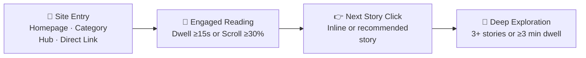

<div align="center">

# 📰 News Website User Engagement Analysis 📊

**A full-stack analytics platform for digital news media — KPIs, reader journeys, editorial insights, and live traffic simulation, all in one dashboard.**


</div>

---

## ✨ What Is This?

This app turns raw reader telemetry — page views, sessions, scroll depth, clicks — into **decision-ready editorial intelligence**. It computes engagement KPIs, models a 4-stage reading funnel, benchmarks content across journalism categories, surfaces drop-off points, and generates automated, rule-based recommendations an editorial team can act on immediately.

> Built to answer the question every newsroom asks: *"What are readers actually doing on our site — and what should we change?"*

---

## 🚀 Feature Highlights

| | Feature | What It Does |
|---|---|---|
| 📈 | **KPI Engine** | Page views, sessions, unique visitors, bounce rate, session duration, and recommendation CTR — with automatic period-over-period % deltas |
| 🧭 | **Navigation Funnel** | Tracks readers through 4 stages: Entry → Engaged Reading → Next Story Click → Deep Exploration |
| 📉 | **Drop-Off Detection** | Scroll-depth retention curve (0–100%) plus top entry/exit pages with bounce & departure rates |
| 🏆 | **Content Benchmarking** | Ranks stories across 6 categories, flags top 5 performers vs. bottom 5 underperformers |
| 🔥 | **24/7 Heatmap** | Day × hour readership intensity, plus category × device cross-tabulation |
| 🤖 | **Recommendation Engine** | Rule-based editorial & UX suggestions — mobile bounce fixes, monetization opportunities, newsletter targeting |
| ⚡ | **Live Simulator** | Inject synthetic reader visits in real time and watch dashboards update instantly |

---

## 🧮 The Engagement Score

Every article gets a single composite score blending reach, depth, and interaction:

$$
\text{Score} = \left(\frac{\text{Views}}{\text{MaxViews}} \times 35\right) + \left(\frac{\text{AvgTime}}{\text{TargetTime}} \times 30\right) + \left(\frac{\text{AvgScroll}}{100} \times 20\right) + \left(\frac{\text{CTR}}{25} \times 15\right)
$$

| Weight | Signal | Why It Matters |
|---|---|---|
| 35% | Views (relative to max) | Reach |
| 30% | Avg. time on page | Depth of attention |
| 20% | Avg. scroll depth | Content consumption |
| 15% | Recommendation CTR | Discovery & retention |

---

## 🏗️ Architecture

```
news-engagement-analytics/
├── backend/
│   ├── src/
│   │   ├── server.js                     # Express HTTP server (Port 5000)
│   │   ├── db/
│   │   │   ├── database.js               # Node.js 24 native node:sqlite engine
│   │   │   ├── schema.sql                # SQLite schema (articles, user_sessions, page_views)
│   │   │   └── seed.js                   # 30-day realistic news dataset generator
│   │   ├── routes/
│   │   │   └── api.js                    # REST API route endpoints
│   │   ├── controllers/
│   │   │   └── analyticsController.js    # Data aggregation & handler logic
│   │   └── services/
│   │       ├── metricsEngine.js          # KPI calculation & period delta comparison
│   │       ├── navigationEngine.js       # 4-stage funnel & drop-off analytics
│   │       └── recommendationEngine.js   # Rule-based editorial insights & action items
│   └── tests/
│       └── api.test.js                   # Node test runner suite
├── frontend/
│   ├── src/
│   │   ├── api/client.js                 # API service layer
│   │   ├── context/AnalyticsContext.jsx  # Global state (timeframe, category, device filters)
│   │   ├── components/
│   │   │   ├── Header.jsx                # Brand, real-time feed toggle, theme switch
│   │   │   ├── Sidebar.jsx               # Navigation tabs and demo reset
│   │   │   ├── FilterBar.jsx             # Date presets, category, device selectors
│   │   │   ├── KPICards.jsx              # Formatted KPI tiles with % deltas
│   │   │   ├── ArticleDetailModal.jsx    # Drilldown into individual story telemetry
│   │   │   └── ExportModal.jsx           # CSV & JSON reporting
│   │   └── views/
│   │       ├── OverviewDashboard.jsx     # Executive overview, timeline chart & distributions
│   │       ├── ContentPerformance.jsx    # Ranked stories, category bars & search table
│   │       ├── UserNavigationFlow.jsx    # 4-stage visual funnel & drop-off curves
│   │       ├── HeatmapGrid.jsx           # 24/7 day-hour heatmap & device cross-matrix
│   │       ├── RecommendationsPanel.jsx  # Prioritized editorial remediations
│   │       └── LiveSimulator.jsx         # Real-time reader visit injector
│   ├── tailwind.config.js
│   └── vite.config.js                    # Vite dev server with proxy to backend
└── package.json                          # Root orchestration scripts
```

---

## 📸 Screenshots

<table>
<tr>
<td width="50%">

**Executive Overview**


</td>
<td width="50%">

**Content Performance & Ranking**


</td>
</tr>
<tr>
<td width="50%">

**Engagement Heatmap & Cross-Matrices**


</td>
<td width="50%">

**Automated Insights & Action Plan**


</td>
</tr>
<tr>
<td width="50%">

**Live Traffic Simulator**


</td>
<td width="50%">

</td>
</tr>
</table>

---

## 🗺️ The Reading Funnel



Paired with a **scroll-depth retention curve** at 0%, 25%, 50%, 75%, and 100% milestones, plus top entry pages (with bounce rate) and top exit pages (with departure %).

---

## 🗄️ Database Model (SQLite)

<details>
<summary><strong>📄 articles</strong></summary>

`id` · `slug` · `title` · `category` · `author` · `publish_date` · `read_time_min` · `word_count` · `summary` · `tags`
</details>

<details>
<summary><strong>👤 user_sessions</strong></summary>

`session_id` · `user_id` · `entry_page` · `exit_page` · `duration` · `bounce_status` · `device_type` · `traffic_source` · `country` · `created_at`
</details>

<details>
<summary><strong>👁️ page_views</strong></summary>

`view_id` · `session_id` · `article_id` · `page_url` · `timestamp` · `time_spent` · `scroll_depth_pct` · `clicked_recommendation`
</details>

---

## 🔌 REST API Reference

| Method | Endpoint | Description |
| :--- | :--- | :--- |
| `GET` | `/api/health` | Service health status |
| `GET` | `/api/metrics` | Summary KPIs, period deltas, timeline points, category/device breakdown |
| `GET` | `/api/content-performance` | Ranked articles, category benchmark bars, top & underperformers |
| `GET` | `/api/user-navigation` | 4-stage journey funnel, scroll retention curve, entry/exit drop-offs |
| `GET` | `/api/recommendations` | Automated editorial & UX recommendations |
| `GET` | `/api/heatmap` | 24/7 hourly readership matrix and category × device cross-matrix |
| `GET` | `/api/articles/:id` | Detailed telemetry & diagnostics for a single story |
| `POST` | `/api/simulate-event` | Inject simulated reader visits into the live database |
| `POST` | `/api/reset-data` | Re-seed database with the standard baseline dataset |

**Query parameters** (supported on `GET` endpoints):

| Param | Values |
|---|---|
| `dateRange` | `today` · `7d` · `30d` *(default)* · `90d` |
| `category` | `all` *(default)* · `Politics` · `Tech` · `Entertainment` · `Sports` · `Business` · `Science` |
| `deviceType` | `all` *(default)* · `desktop` · `mobile` · `tablet` |
| `sortBy` | `views` · `avgTimeSpent` · `avgScrollDepth` · `ctr` · `engagementScore` *(default)* |
| `order` | `desc` *(default)* · `asc` |

---

## ⚙️ Getting Started

### Prerequisites

- **Node.js** v22.x or v24.x — native `node:sqlite` requires Node 22+
- **npm** v10+

### 1️⃣ Clone the repo

```bash
cd news-engagement-analytics
```

### 2️⃣ Install dependencies

```bash
# Backend
cd backend
npm install

# Frontend
cd ../frontend
npm install
```

### 3️⃣ Seed the database *(optional — pre-seeded on first run)*

```bash
cd backend
npm run seed
```

### 4️⃣ Run it

| Terminal | Command | Runs On |
|---|---|---|
| 1 — Backend | `cd backend && npm start` | `http://localhost:5000` |
| 2 — Frontend | `cd frontend && npm run dev` | `http://localhost:5173` |

Then open **[http://localhost:5173](http://localhost:5173)** 🎉

### 5️⃣ Run the test suite

```bash
cd backend
npm test
```

---

## 🤖 What the Recommendation Engine Catches

- 📱 **High mobile bounce** → suggests lazy-loaded banners & readability mode
- ⏱️ **High dwell time, low CTR** → suggests contextual mid-article recommendation cards
- 📉 **Mid-article drop-off** → suggests visual breaks & pull quotes
- 💌 **High-loyalty readers** → flags newsletter acquisition opportunities

---

<div align="center">

Made for newsrooms that want to *understand* their readers, not just count them.

</div>
